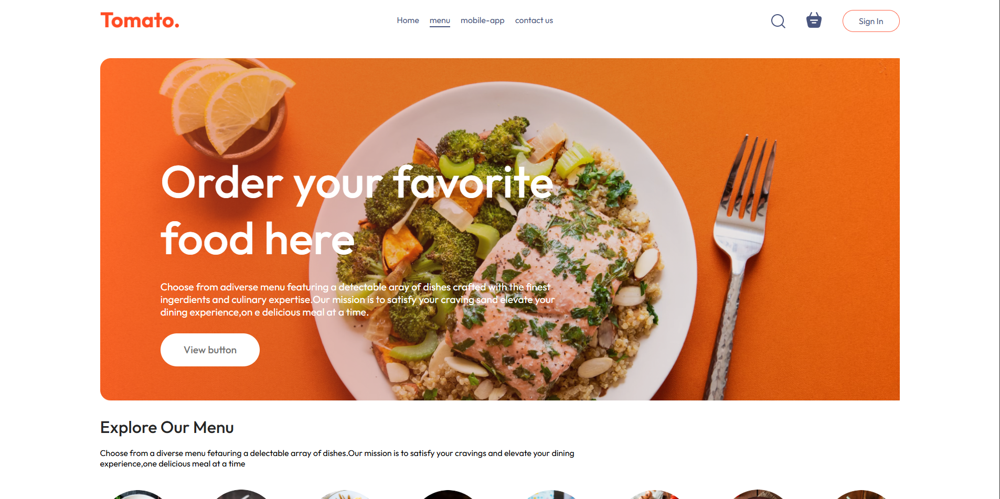
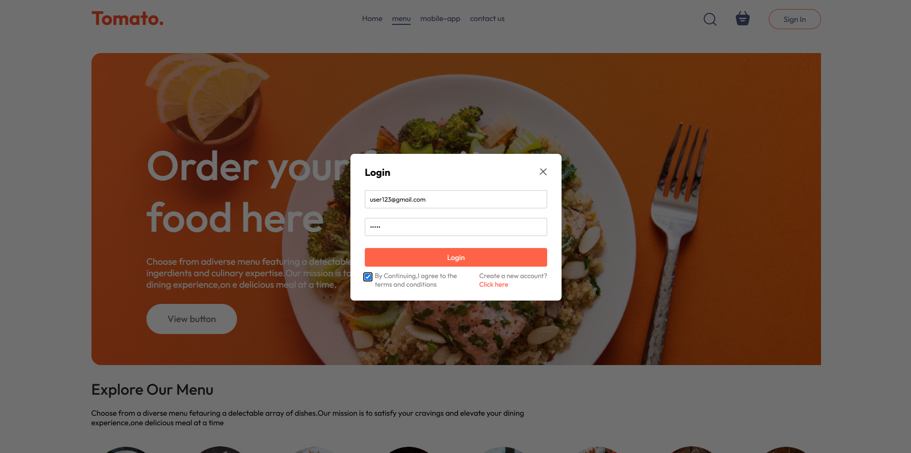
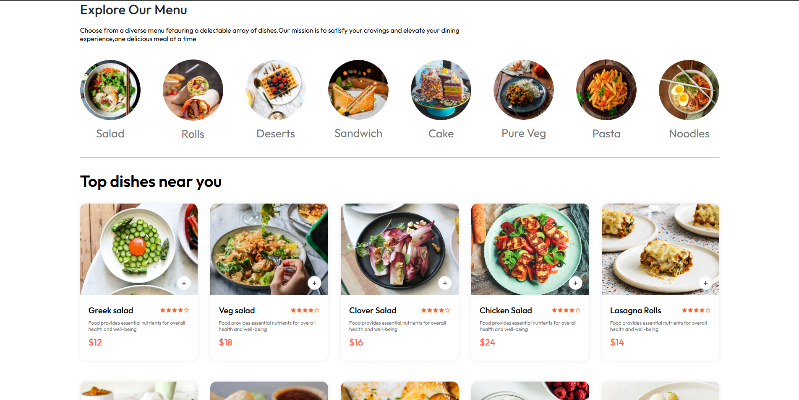
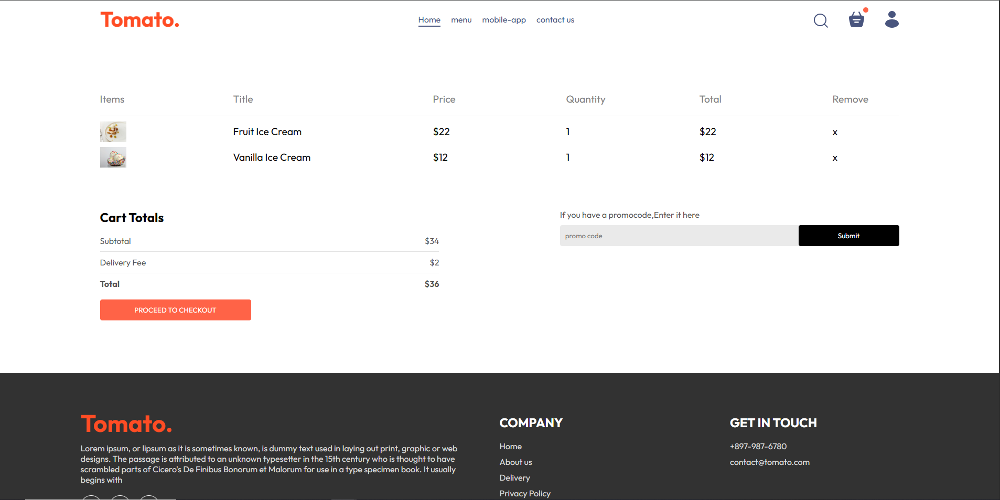

# 🍅 **Tomato – Food Delivery App**

[](https://food-app-frontend-4yt4.onrender.com/)


Tomato is a full-stack food delivery application designed to provide a seamless online food ordering experience. Users can explore restaurant menus, place orders, and track deliveries in real time, while the platform ensures secure authentication and smooth payment processing.

---

## 🚀 **Features**

- 📍 **Restaurant & Menu Browsing** – Discover a variety of restaurants and their offerings.
- 🛒 **Cart & Checkout** – Add items to the cart and proceed with an effortless checkout.
- 🔐 **User Authentication** – Secure login and registration using JWT Web Tokens.
- 💳 **Payment Integration** – Supports Stripe for smooth and secure transactions.
- 📦 **Order Tracking** – Keep track of orders with real-time updates.
- 📱 **Responsive UI** – Designed for optimal performance across devices.

---

## 🛠️ **Tech Stack**

- **Frontend:** React.js, CSS (Styling)
- **Backend:** Node.js, Express.js
- **Database:** MongoDB
- **Authentication:** JWT
- **Payments:** Stripe

---

## 🌍 **Deployment**

The application is deployed and accessible online:

- **User Platform:** [View Live](https://food-app-frontend-4yt4.onrender.com/)
- **Administrative Dashboard:** [View Live](https://food-app-admin-2t72.onrender.com/)

---

## 📌 **Installation & Setup**

```bash
# 1. Clone the repository
git clone https://github.com/DoodleSquash/tomato.git
cd tomato

# 2. Install dependencies
cd frontend && npm install
cd ../backend && npm install
cd ../admin && npm install
```

### **3. Set Up Environment Variables**
Create a `.env` file in the `backend` directory:
```env
MONGODB_URI=your_mongodb_connection_string
STRIPE_SECRET_KEY=your_stripe_secret_key
JWT_SECRET=your_jwt_secret_token
```
> [!TIP]
> **Stripe Testing:** Use test card `4242 4242 4242 4242` with any future expiry date and CVC `123`.

### **4. Start Local Development**
Run the following commands in separate terminals to start each service:
* **Backend Server:** `cd backend && npm run server`
* **Frontend App:** `cd frontend && npm run dev`
* **Admin Dashboard:** `cd admin && npm run dev`

---

## 🖼️ **Interface Preview**

### Core Food Delivery Experience
| **Landing Page Overview** | **Login & Authentication Portal** |
| :---: | :---: |
|  |  |

### Ordering & Cart
| **Interactive Menu** | **Cart & Checkout** |
| :---: | :---: |
|  |  |

### Responsive Design (Mobile View)


### Administrative Panel
| **Admin Add Food Portal** |
| :---: |
|  |

---

## 🛠️ **Contributing**

Contributions are welcome! Feel free to fork the repository, create a new branch, and submit a pull request.

---

### 💡 **Feedback & Support**

For any issues or suggestions, feel free to open an issue on GitHub or contact me at [adityalotankar06@gmail.com](mailto:adityalotankar06@gmail.com).
